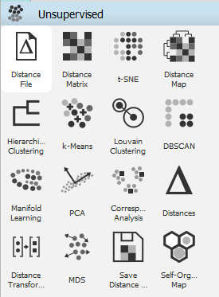
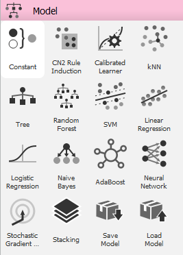
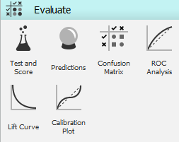
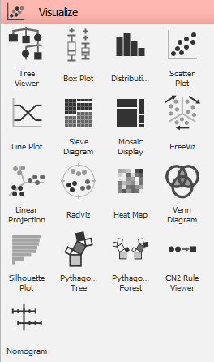
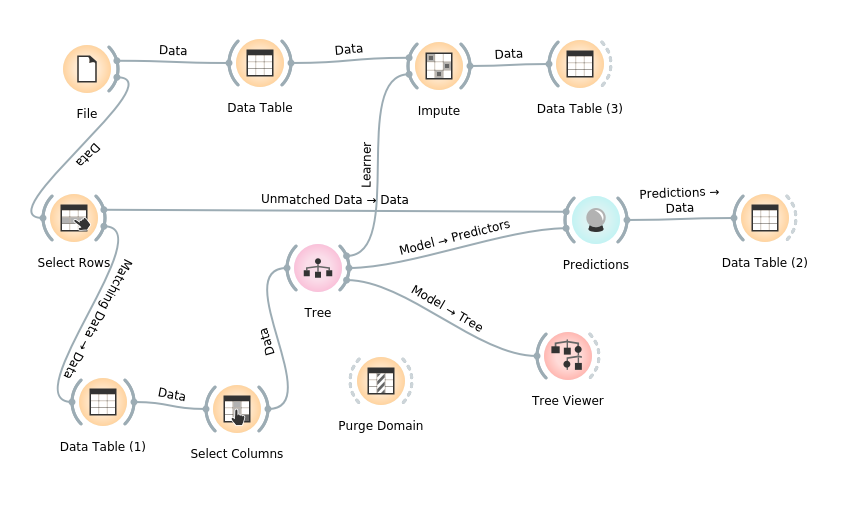
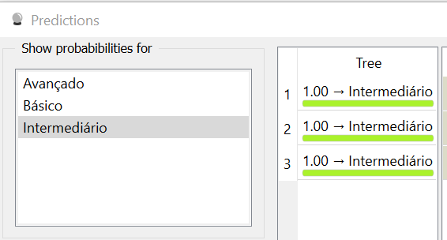
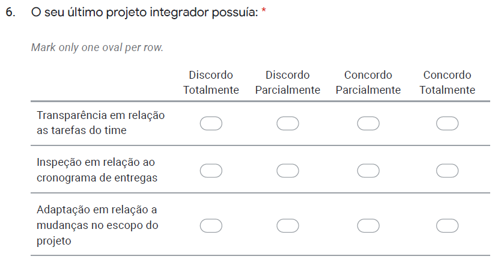
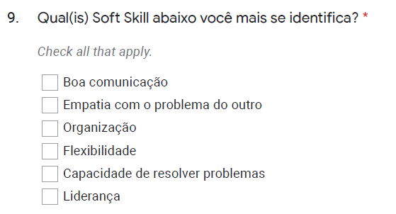

# Descrição do projeto

Este projeto tem como objetivo analisar os dados de pesquisa relacionada às experiências dos alunos durante a disciplina de Projeto Integrador. Nesse contexto, foram consultados alunos do 2º ao 6º termo que se dispuseram voluntariamente a responder o formulário que contém 13 perguntas em torno do tema Metodologia de Gestão. Diante disso, os dados coletados passarão por todas as etapas de pré-processamento, mineração e discussão dos resultados a fim de identificar as principais dificuldades dos alunos durante o projeto. Por fim, os dados correlacionados nesse projeto auxiliará os alunos José Pedro e Iam Caio a embasar o estudo sobre a viabilidade de implementação de uma nova metodologia ágil de gestão de projetos.

# Características da pesquisa

A pesquisa desenvolvida para coletar os dados deste projeto é do tipo quantitativa. Sabendo-se disso, foram elaboradas 13 perguntas em torno do tema Metodologia de Gestão com foco em 5 pilares:

<ul>
  <li>Método</li>
  <li>Técnicas</li>
  <li>Conceitos</li>
  <li>Princípios</li>
  <li>Experiências</li>
</ul>

Nesse contexto, todos os pilares acima foram relacionados pelos alunos diante a Metodologia Scrum já desenvolvida na disciplina. Sendo assim, após as análises feitas, poderemos identificar os pontos positivos e negativos apresentado pelos alunos e propor ou não uma nova metodologia que amenize as dificuldades. 

O formulário juntamente com as perguntas pode ser acessado em: https://forms.gle/Ed3s2KDMzNzYfcKS9 

# Software utilizado

Para a análise dos dados coletados foi necessário um software que buscasse fazer todo o ciclo do Data Mining para que pudéssemos determinar e cruzar os dados para identificar padrões e possíveis pontos de melhoria metodológica no projeto integrador. Com base nisso, foi escolhido o Orange por ser Open-Source, conter uma ótima documentação e uma interface user-friendly.

  

  
Com o uso do Orange foi possível criar um fluxo de tratamento e extração de informação para encontrar padrões. Como exemplo, podemos detectar probabilidades de ocorrerem eventos por base de um histórico utilizando algoritmos disponíveis na plataforma. Nesse contexto, podemos encontrar algoritmos de Machine Learning supervisionados, não-supervisionados e redes neurais para utilização.
  

  
Como visto acima o Orange contém muitas opções de algoritmos para serem utilizados mas também temos vários meios de validar os resultados e métodos utilizados para buscar uma melhor acurácia do modelo.
  

  
Já em relação a visualização podemos ter uma interface simples e intuitiva para extrair informações relevantes e também visualizar dados e previsões feitas pelos algoritmos utilizando diversos modelos de gráficos.
  

 

# Materiais e métodos

## Pré-processamento

De início foi extraído o arquivo em formato .csv do formulário contendo todas as 59 respostas dos alunos. Após este passo foi identificado que havia 3 campos faltantes na coluna “FrontEnd” e que deveriam ser preenchidos. Nesse contexto foi realizado no software Orange o seguinte procedimento:

### a) Input de dados por meio da Árvore de decisão
  

  

Como exposto acima, a Árvore de Decisão identificou por meio do cálculo do ganho de informação as classes que mais afetavam os valores contidos na variável Front-end. Nesse contexto, o algoritmo traçou a melhor probabilidade do preenchimento dos campos ausentes e nos retornou o seguinte resultado:

  

  

Com isso, os 3 campos ausentes foram preenchidos com o valor “Intermediário” na classe Front-end.

### b) Renomeação de atributos para facilitar análises

Seguindo o pré-processamento, foram simplificadas as respostas nas perguntas 04, 06 e 08, como exemplo:

  

  

Sabendo-se disso, foi utilizado o software Excel para renomear as respostas sendo  abreviadas para DT, DP, CP e CT.

### c) Discretização de classes para facilitar análises

Em relação a discretização, foi encontrado dificuldades em analisar as respostas nas perguntas 07 e 09 por conter múltiplas respostas em um único campo, como exemplo:

  

  

Como a imagem acima, foram criadas as respectivas classes referenciando cada resposta, sendo feita posteriormente a binarização 0 ou 1 (sim ou não) de acordo com a resposta de cada aluno. Este processo irá facilitar a correlação de dados posteriormente. 

## Mineração

## Validação

## Resultados e discussão

## Conclusão

