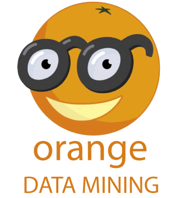

# Descrição do projeto

Este projeto tem como objetivo analisar os dados de pesquisa relacionada às experiências dos alunos durante a disciplina de Projeto Integrador. Nesse contexto, foram consultados alunos do 2º ao 6º termo que se dispuseram voluntariamente a responder o formulário que contém 13 perguntas em torno do tema Metodologia de Gestão. Diante disso, os dados coletados passarão por todas as etapas de pré-processamento, mineração e discussão dos resultados a fim de identificar as principais dificuldades dos alunos durante o projeto. Por fim, os dados correlacionados nesse projeto auxiliará os alunos José Pedro e Iam Caio a embasar o estudo sobre a viabilidade de implementação de uma nova metodologia ágil de gestão de projetos.

# Características da pesquisa

Para dar início a coleta de dados foi elaborada uma pesquisa por meio da plataforma Google Forms. Esse formulário teve como público alvo alunos da disciplina de Projeto Integrador do 2º ao 6º termo, do qual obteve-se a resposta de 59 estudantes. A pesquisa em questão foi disponibilizada entre os dias 06/09/2020 à 15/09/2020 com foco em entender o nível de afinidade com a metodologia Scrum, trabalhada na disciplina, e as dificuldades que podem ser sanadas com o uso de outra metodologia de gestão de projetos de software para aumentar e melhorar a produtividade da equipe. Nesse contexto, foram exploradas cinco áreas de interesse para entender o ambiente de estudo, sendo:

<ul>
  <li>Método</li>
  <li>Técnicas</li>
  <li>Conceitos</li>
  <li>Princípios</li>
  <li>Experiências</li>
</ul>

Nesse contexto, todos os pilares acima foram relacionados pelos alunos diante a Metodologia Scrum já desenvolvida na disciplina. Sendo assim, após as análises feitas, podemos identificar os pontos positivos e negativos apresentados pelos alunos e propor ou não a introdução de uma nova metodologia de gestão de projetos de software que amenize as dificuldades.

Foi utilizada a escala Likert adaptada para medir a importância dos temas apresentados com a remoção da medida “Não Concordo e Nem Discordo” evitando a neutralidade das respostas. O conteúdo abordado visa também explorar as habilidades técnicas dos alunos, competências e habilidades pessoais necessárias para o trabalho em grupo e experiências com liderança em métodos ágeis.

No link abaixo, observa-se as perguntas e suas respectivas alternativas utilizadas no formulário de coleta de dados sobre a experiência dos alunos na utilização da metodologia Scrum, onde as opções em algumas perguntas são Discordo Totalmente (DT); Discordo Parcialmente (DP); Concordo Parcialmente (CP); Concordo Totalmente (CT).

O formulário juntamente com as perguntas pode ser acessado em: https://forms.gle/Ed3s2KDMzNzYfcKS9 

# Software utilizado

Para a análise dos dados coletados foi necessário um software que buscasse fazer todo o ciclo do Data Mining para que pudéssemos determinar e cruzar os dados para identificar padrões e possíveis pontos de melhoria metodológica no projeto integrador. Com base nisso, foi escolhido o Orange por ser Open-Source, conter uma ótima documentação e uma interface user-friendly.

  

  
Com o uso do Orange foi possível criar um fluxo de tratamento e extração de informação para encontrar padrões. Como exemplo, podemos detectar probabilidades de ocorrerem eventos por base de um histórico utilizando algoritmos disponíveis na plataforma. Nesse contexto, podemos encontrar algoritmos de Machine Learning supervisionados, não-supervisionados e redes neurais para utilização.
  

  
Como visto acima o Orange contém muitas opções de algoritmos para serem utilizados mas também temos vários meios de validar os resultados e métodos utilizados para buscar uma melhor acurácia do modelo.
  

  
Já em relação a visualização podemos ter uma interface simples e intuitiva para extrair informações relevantes e também visualizar dados e previsões feitas pelos algoritmos utilizando diversos modelos de gráficos.
  

 

# Materiais e métodos

As etapas de manipulação dos dados feitas nessa pesquisa foram seguindo o processo de Knowledge Discovery in Databases (KDD) composto por seis etapas, sendo elas: entendimento do domínio; agrupamento de dados; pré-processamento; transformação; Data Mining; pós-processamento.

## Pré-processamento

De início foi extraído o arquivo em formato .csv do formulário contendo todas as 59 respostas dos alunos. Após este passo foi identificado que havia 3 campos faltantes na coluna “FrontEnd” e que deveriam ser preenchidos. Nesse contexto foi realizado no software Orange o seguinte procedimento:

### a) Input de dados por meio da Árvore de decisão
  

  

Como exposto acima, a Árvore de Decisão identificou por meio do cálculo do ganho de informação as classes que mais afetavam os valores contidos na variável Front-end. Nesse contexto, o algoritmo traçou a melhor probabilidade do preenchimento dos campos ausentes e nos retornou o seguinte resultado:

  

  

Com isso, os 3 campos ausentes foram preenchidos com o valor “Intermediário” na classe Front-end.

### b) Renomeação de atributos para facilitar análises

Seguindo o pré-processamento, foram simplificadas as respostas nas perguntas 04, 06 e 08, como exemplo:

  

  

Sabendo-se disso, foi utilizado o software Excel para renomear as respostas sendo  abreviadas para DT, DP, CP e CT.

### c) Discretização de classes para facilitar análises

Em relação a discretização, foi encontrado dificuldades em analisar as respostas nas perguntas 07 e 09 por conter múltiplas respostas em um único campo, como exemplo:

  

  

Como a imagem acima, foram criadas as respectivas classes referenciando cada resposta, sendo feita posteriormente a binarização 0 ou 1 (sim ou não) de acordo com a resposta de cada aluno. Este processo irá facilitar a correlação de dados posteriormente. 

## Mineração

Visando entender as dificuldades dos alunos acerca dos Princípios e Práticas foram elaboradas perguntas norteadoras que buscam relacionar e compreender os métodos ágeis e o comportamento gerado com o uso desses métodos. As perguntas elaboradas estão apresentadas na Tabela 2.

<table>
  <tr>
    <th>Número</th>
    <th>Pergunta</th>  
  </tr>
  <tr>
    <td style="text-align: center">1</td>
    <td>De acordo com os princípios de Transparência, Inspeção e Adaptação, qual deles mais influência para se ter uma equipe com desempenho bom (3)?</td>
  </tr>
  <tr>
    <td style="text-align: center">2</td>
    <td>Qual é a importância de se realizar cerimônias para se ter uma equipe com desempenho bom (3)?</td>
  </tr>
  <tr>
    <td style="text-align: center">3</td>
    <td>Qual a relação de se ter o conhecimento de BackEnd e FrontEnd diante uma equipe de desempenho bom (3)?</td>
  </tr>
</table>

Foram utilizadas na pergunta de número 1 exibida na Tabela 2 as técnicas de Silhouettes Graph (ROUSSEEUW, 1987) para verificar a distância entre atributos e a qual cluster o mesmo pertence utilizando a escala de 0 a 1, sendo que quanto mais próximo de 1, mais ao centro o atributo se encontra do cluster; FreeViz (DEMŠAR; LEBAN; ZUPAN, 2007) sendo uma técnica que utiliza o algoritmo de otimização hill-climbing (CHALUP; MAIRE, 1999) para buscar um equilíbrio entre os vetores (atributos) de forma visual para destacar os vetores que são de extrema relevância; Logistic Regression (JR; LEMESHOW; STURDIVANT, 2013) visando a classificação do conjunto de dados para extrair os pesos encontrados por meio dele e Association Rules (AGRAWAL et al., 1994) com a finalidade de destacar as principais regras de associação baseado em uma confiança de 90% e suporte de 10%.

Na pergunta de número 2 também foram utilizadas as técnicas de  Silhouettes Graph (ROUSSEEUW, 1987); FreeViz (DEMŠAR; LEBAN; ZUPAN, 2007) e Logistic Regression (JR; LEMESHOW; STURDIVANT, 2013). Além disso, para esta análise foi adicionado o Support Vector Machine (SVM) (HEARST et al., 1998) utilizado na criação de um modelo de classificação.
Na pergunta de número 3 também foram utilizadas as técnicas de Association Rules (AGRAWAL et al., 1994) e Support Vector Machine (SVM) (HEARST et al., 1998). Adicionalmente, para compor esta análise foi aplicado o classificador Decision Tree, precursor do algoritmo Random Tree (BREIMAN, 2001), criando uma árvore com objetivo de determinar em qual classe aqueles atributos se assemelham e Scatter Plot sklearn (PEDREGOSA et al., 2011) gerando um gráfico de dispersão de dois eixos.

## Validação

# Resultados e discussão

# Conclusão

